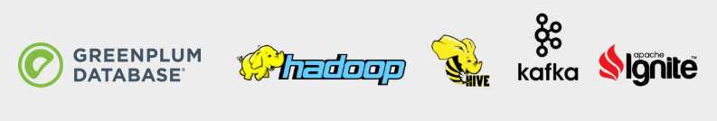
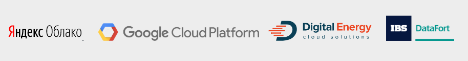
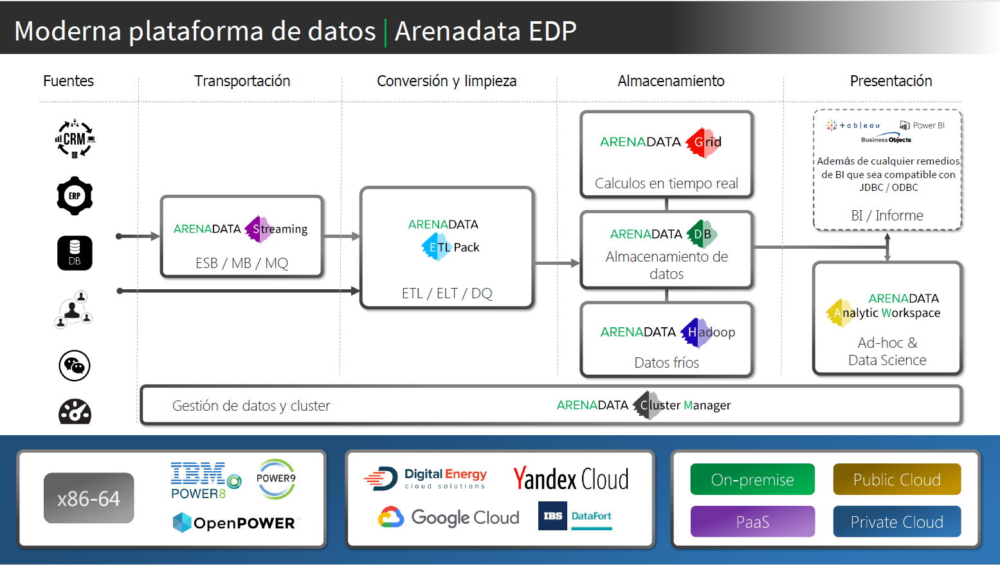
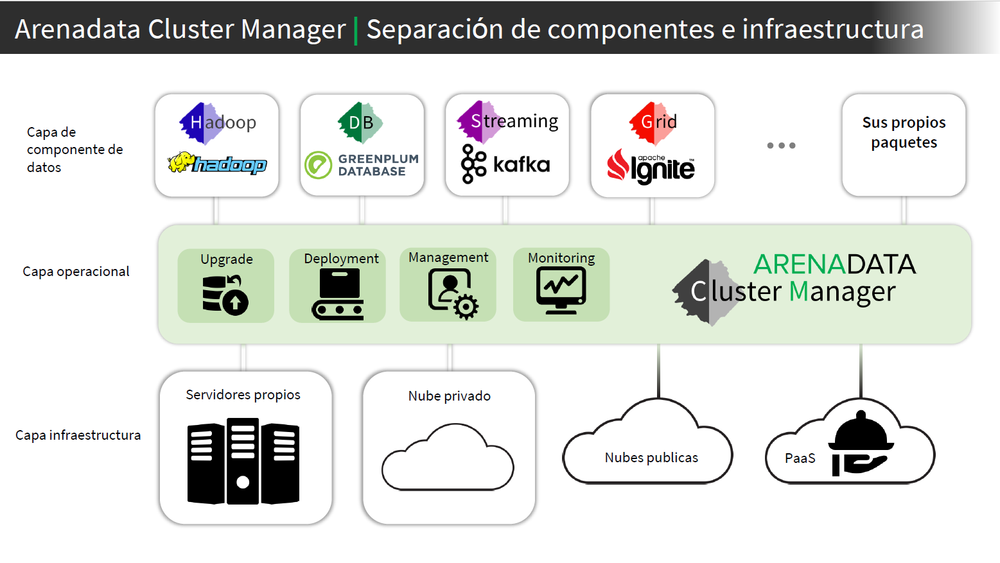
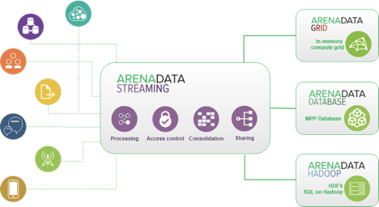

Перевод
========

.. important:: Документ в стадии разработки. Не использовать приведенную информацию

ADCM
---------

1) Страница сайта `ссылка <https://arenadata.tech/products/adcm/>`_ 

**Arenadata Clúster Manager** (**ADCM**) proporciona una manera eficiente de implementar y administrar todos los servicios de datos de la empresa, independientemente de la infraestructura utilizada, en la nube, on-premise o como servicios de PaaS. Al dividir la plataforma de datos en dos capas lógicamente no vinculadas -- la capa de infraestructura y la capa de aplicaciones -- el explotación de toda la plataforma se vuelve predecible, flexible y repetible.

**ADCM** tiene una estructura modular -- agregue la funcionalidad que necesita para trabajar con aplicaciones y equipos, según sea necesario. Los módulos tienen un formato abierto que le permite crear sus propios módulos para aplicaciones altamente especializadas y propietarias.

Gracias a la avanzada de REST API, otros sistemas pueden usar **ADCM** para automatizar el trabajo con su plataforma de datos.

**ADCM** viene en forma de docker-image, por lo que su implementación y uso es muy simple.

Funcionalidad de la aplicación:

* Despliegue;
* Actualización;
* Gestión (Administración);
* Vigilancia (Monitoring);
* Integración de componentes.

Aplicaciones soportadas (:numref:`Рис.%s.<ADCM_aplicaciones>`).

.. _ADCM_aplicaciones:

   Aplicaciones soportadas

Proveedores de nube soportados (:numref:`Рис.%s.<ADCM_proveedores>`).

.. _ADCM_proveedores:

   Proveedores de nube soportados
   

Funcionalidad de infraestructura:

* Creacion / eliminacion MV;
* Trabajo con hosts físicos;
* Preparación de MV / hosts;
* Vigilancia (Monitoring);
* Gestión (Administración) de usuarios;
* Gestión (Administración) de acceso.

Demostración: `URL <https://arenadata.tech/products/adcm/>`_.

Diapositiva 7
^^^^^^^^^^^^^^^

.. _slide7:

   Moderna plataforma de datos

Diapositiva 15
^^^^^^^^^^^^^^^^

.. _slide15:

   Separación de componentes e infraestructura

Слайд 22
^^^^^^^^^^^^

4) Слайд 22 Обзорной презентации

Слайд 23
^^^^^^^^^^

5) Слайд 23 Обзорной презентации

ADS
---------

Arenadata Streaming
^^^^^^^^^^^^^^^^^^^^^^

6) https://arenadata.tech/products/ads/

**Arenadata Streaming** (**ADS**) -- es una solución eficiente escalable y tolerante a fallos para el procesamiento de datos ``en cadena`` en tiempo real, adaptada para uso corporativo y construida sobre la base de **Apache Kafka** y **Apache Nifi** -- proyectos con código abierto.

Una de las características de la implementación de la plataforma es el uso de tecnología similar a los registros de transacciones utilizados en los sistemas de administración de bases de datos.

La plataforma de transmisión tiene tres capacidades principales:

* Publicación y suscripción a una transmisión de datos ``en cadena`` similar a una cola de mensajes o un sistema de mensajería corporativa;
* Almacenamiento registros de forma tolerante a fallos;
* Procesamiento de registros a medida que ocurren.

**ADS** se utiliza ``generalmente`` para dos amplias clases de aplicaciones:

* Creación de un canal para la transmisión de datos ``en cadena`` en tiempo real para garantizar un intercambio de datos confiable entre sistemas y aplicaciones;
* Creación de aplicaciones para la transmisión de datos ``en cadena`` en tiempo real para convertirlas e interactuar con ``otras cadenas`` (otros flujos).

.. _ADS-esquema:

   Esquema de ADS

Ventajas principales
~~~~~~~~~~~~~~~~~~~~~

Punto de acceso único:

* Utilice como bus corporativo intercambio de datos para todas sus aplicaciones.

Una forma fácil, segura y confiable de controlar el flujo de datos:

* Recopile grandes flujos de datos de forma segura y ``administrarlos`` (gestionarlos) efectivamente en tiempo real.

Políticas de seguridad:

* Crea flujos de datos con soporte para ``la diferenciación de los`` derechos de acceso.

Desarrollo rápido y continuo:

* Desarrolle aplicaciones analíticas de flujo en cuestión de minutos en tiempo real sin una sola línea de código.

**ADS** contiene todos los componentes necesarios para recopilar, analizar y procesar datos en tiempo real, proporciona almacenamiento y transferencia en la semántica "exactly-once delivery" de una manera segura y tolerante a fallos, proporcionando una interfaz conveniente para la administración y el desarrollo.

Características técnicas
~~~~~~~~~~~~~~~~~~~~~~~~~

Tolerancia a fallos:

* La arquitectura de la solución permite garantizar la consistencia en la transmisión de datos en tiempo real.

Escalabilidad:

* Agregar nuevos servidores al clúster según sea necesario.

Distribución:

* Posibilidad de construir una infraestructura geo-distribuida.

Equipo disponible:

* Funciona en cualquier hardware compatible con x86. Obtenga los requisitos del sistema recomendados por nuestros especialistas.

Tiempo real:

* Control de flujos, adición y configuración de fuentes de datos en tiempo real.

Seguridad:

* Mecanismos flexibles de control de acceso a datos.

Integración:

* Conectores a varios sistemas: Elasticsearch, SAP HANA, Vertica, Couchbase, Cassandra, CouchDB, IBM MQ, etc. Un amplio conjunto de API para la integración con otros sistemas externos.

Simplicidad y flexibilidad:

* Le permite crear el workflow con la ayuda del interfaz gráfico o desarrollar sus propias aplicaciones utilizando el SDK para mejorar la eficiencia del trabajo.

docs.arenadata
^^^^^^^^^^^^^^^^

7) https://docs.arenadata.io/ads/

Una solución efectiva para el procesamiento de datos ``en cadena`` en tiempo real

**Arenadata Streaming** (**ADS**) -- una plataforma de flujo de trabajo basada en **Apache Kafka** y **Apache Nifi**, proyectos de código abierto, adaptados para uso corporativo. **ADS** contiene todos los componentes necesarios para recopilar, analizar y procesar datos en tiempo real, proporciona almacenamiento y transferencia en la semántica "exactly-once delivery" de una manera segura tolerante a fallas proporcionando una interfaz conveniente para la administración y el desarrollo. Además, la plataforma puede actuar como un bus de datos corporativo y una herramienta ETL. 

.. _Concepto-de-ADS:

.. figure:: imgs/Concepto-de-ADS.png
   :align: center

   Concepto de la plataforma ADS

La idea de la plataforma de transmisión distribuida es proporcionar:

* Punto de acceso único;
* Una forma fácil, segura y confiable de controlar el flujo de datos;
* Políticas de seguridad;
* Desarrollo rápido y continuo.

Una de las características de la implementación de la plataforma es la aplicación de una técnica similar a los registros de transacciones utilizados en los sistemas de administración de bases de datos. **ADS** tiene las siguientes cualidades técnicas distintivas:

* *Tolerancia a fallos* -- provisión de la consistencia en la transmisión de datos en tiempo real;
* *Escalabilidad* -- agregar nuevos servidores al clúster según sea necesario.
* *Distribución* -- posibilidad de construir una infraestructura geo-distribuida.
* *Equipo disponible* -- funciona en cualquier hardware compatible con x86. Obtenga los requisitos del sistema recomendados por nuestros especialistas.
* *Tiempo real* -- control de flujos, adición y configuración de fuentes de datos en tiempo real.
* *Seguridad* -- mecanismos flexibles de control de acceso a datos.
* *Integración* -- conectores a varios sistemas: Elasticsearch, SAP HANA, Vertica, Couchbase, Cassandra, CouchDB, IBM MQ, etc. Un amplio conjunto de API para la integración con otros sistemas externos.
* *Simplicidad y flexibilidad* -- le permite crear el workflow con la ayuda del interfaz gráfico o desarrollar sus propias aplicaciones utilizando el SDK para mejorar la eficiencia del trabajo. 

**Apache Kafka** -- distribuido agente de software de mensajes, un proyecto de código abierto desarrollado dentro de la **Apache Software Foundation**.

La versión actual de **ADS** versión **1.0.0** se lanzó en el segundo trimestre de 2018. La versión incluye los siguientes componentes: **Ambari**, **Zookeeper**, **NiFi**, **Kafka**. La integración con **ZooKeeper** permite que el sistema funcione no solo de forma rápida y sin problemas, sino también de forma segura, lo que es especialmente importante en el caso de Big Data.

Con **Arenadata Streaming**, obtiene una solución eficiente para el procesamiento de datos:

* Úselo como un bus de datos corporativo para todas sus aplicaciones;
* Recopile grandes flujos de datos de forma segura y eficiente adminístrelos en tiempo real;
* ``Crea flujos de datos con soporte para la diferenciación de los derechos de acceso`` (Crea flujos de datos con la distinción de derechos de acceso);
* Desarrolla aplicaciones analíticas de transmisión en minutos en tiempo real sin una sola línea de código.

La documentación original en ruso permite facilitar el proceso de planificación y despliegue de la plataforma. La instrucción puede ser útil para los administradores, programadores, desarrolladores y empleados de los departamentos de tecnología de la información que implementan y mantienen los clústeres de **Arenadata**.

La siguiente documentación describe la plataforma **Arenadata Streaming**: conceptos de almacenamiento, instalación, características arquitectónicas, APIs y configuración de la plataforma.

+	Можно добавить отсюда https://docs.arenadata.io/ads/Intro/index.html
+	Слайд 21 Обзорной презентации
+	Дополнение https://docs.arenadata.io/ads/Architecture/intro.html

ADB
----

docs.arenadata
^^^^^^^^^^^^^^^^^

8) https://arenadata.tech/products/db/ (аналогично тут https://docs.arenadata.io/adb/)

**Arenadata** **DB** (**ADB**) -- SGBD distribuido, utilizando el concepto de MPP (massively parallel processing, procesamiento masivamente paralelo) y basado en SGBD con código abierto -- Greenplum.

Los SGBD masivos paralelos analíticos están diseñados para almacenar y procesar grandes cantidades de datos -- desde unidades hasta cientos de terabytes de datos.Estas SGBD se utilizan con mayor frecuencia para el análisis predictivo, la elaboración de informes periódicos, el análisis de la rotación de clientes y la creación de almacenes de datos corporativos.

Hasta hace poco, el mercado de bases de datos analíticas SGBD dividieron cuatro jugadores (Vertica, Teradata, Netezza y Greenplum) que existían fuera de la comunidad Open Source, pero la situación cambió en 2017, cuando el proyecto Greenplum pasó a la categoría de proyectos abiertos.

El descubrimiento del código fuente permitió al equipo de Arenadata iniciar el proyecto -- **Arenadata** **DB** (**ADB**) -- un SGBD relacional que tiene una arquitectura paralela masiva sin compartir recursos (Shared Nothing) y está diseñado para almacenar, procesar y analizar grandes cantidades de datos estructurados y poco estructurados. Con la capacidad de procesamiento de cientos de servidores, un optimizador de consultas avanzado y un sistema de redundancia de datos flexible, **ADB** mejora significativamente el rendimiento y la fiabilidad al mantener el acceso a los datos heredado de las aplicaciones **ANSI** **SQL** (totalmente compatible con PostgreSQL).

La arquitectura ADB es un clúster clásico: varios segmentos de servidor, un servidor maestro y un servidor de respaldo, interconectados por redes rápidas (10G Ethernet o Infiniband). Cada segmento de servidor tiene varios segmentos (instancias) de PostgreSQL que contienen datos. En caso de que falle uno o varios segmentos, se marcan como fallidos y en lugar de ellos se inician sus segmentos duplicados, los datos se replican utilizando la tecnología de grabación avanzada utilizada en el DBMS de PostgreSQL (Wright Ahead Log, WAL -- todos los cambios en las tablas e índices se escriben en el archivo solo después su registro).

El uso de varias interconexiones permite aumentar la capacidad del canal de interacción entre los segmentos entre sí y garantizar la tolerancia a fallos del clúster debido a la redistribución del tráfico. La distribución de segmentos a través de las interfaces de red se elige individualmente y se puede ajustar a las tareas del clúster -- por ejemplo, todos los segmentos principales pueden utilizarse para usar un interfaz de red, los segmentos de respaldo usarán el segundo.

El ADB implementa un esquema clásico de separación (sharding) de datos -- cada tabla consta de N tablas alojadas en N segmentos de clúster. La lógica de división de la tabla en segmentos se establece mediante la clave (campo) de distribución. Para cada columna individual de la tabla, puede especificar su tipo y nivel de compresión. Además de los tipos de compresión inicialmente disponibles en Greenplum -- zlib (una de las bibliotecas de compresión más utilizadas, en particular, se usa en distribuciones de Linux) y RLE delta compression (almacenamiento de cambios entre los valores de los campos en la columna), el algoritmo zstandard desarrollado por Facebook e implementado por el equipo de Arenadata, que ofrece casi cuatro veces más rendimiento que zlib.

ADB utiliza el almacenamiento polimórfico de datos, por ejemplo, una tabla se puede dividir en secciones verticales (particiones), algunas de las cuales se almacenarán como filas y otras como objetos de columna. Al mismo tiempo, para el usuario esta tabla se verá como un solo objeto.

La seguridad en ADB se logra cifrando los datos y las conexiones de cliente de servidor a través de SSL en todas las etapas de su ciclo de vida. Además, todas las interacciones internas de los componentes SGBD ADB (segmentos, espejos y asistentes) también se pueden cifrar con SSL, y los datos almacenados en los discos del clúster se pueden cifrar utilizando claves PGP (a nivel de tabla o columna en las tablas). Todo esto permite excluir situaciones de búsqueda de datos en forma no encriptada.

La delimitación de las zonas de visibilidad de datos y los derechos de acceso se proporciona a través del modelo de acceso (Role Based Access Control, RBAC), que permite la implementación de reglas de control de acceso flexibles que son flexibles y cambian dinámicamente durante la operación de la plataforma de procesamiento y almacenamiento de datos. Así, por ejemplo, puede crear esquemas para restringir el acceso a tablas y otros objetos SGBD, así como a filas y columnas de tablas individuales.

Una de las cualidades más importantes de un SGBD analítico es la flexibilidad y la productividad en el intercambio de datos con sistemas externos. En particular, ADB implementa un protocolo de intercambio paralelo de datos con sistemas de terceros, PDF (Platform eXtension Framework), que permite la interacción con el sistema externo simultáneamente en todos los segmentos del clúster. Si el sistema de origen también es un clúster, puede utilizar la interacción en clúster en ambos lados para mejorar el rendimiento y aumentar la velocidad de la interacción a medida que se amplían los clústeres.

El sistema de respaldo flexible le permite implementar un clúster con un nivel predeterminado de tolerancia a fallas, lo que permite que el SGBD funcione incluso si la mitad de los servidores del clúster falla. Y una mayor selección de estrategias de almacenamiento de datos en ADB proporciona el rendimiento necesario en todas las etapas del ciclo de vida de los datos -- desde la recepción de nuevos datos en línea, el almacenamiento de datos básicos con diferentes niveles de compresión hasta la exportación de datos archivados al clúster de Hadoop.

**Ventajas clave de ADB:**

* Todo el apoyo y la experiencia en la implementación está disponible en Rusia y en ruso.
* Desarrollado un paquete de utilidades para la instalación sin conexión (sin acceso a Internet).
* La distribución se basa en Open-source el núcleo del SGBD de Greenplum. 
* Software completamente ruso.
* El soporte está disponible de forma remota y en el sitio (on-site). Hay un conjunto de servicios de paquetes disponibles para planificar, instalar y auditar el sistema.
* Hay la posibilidad de la elaboración y la personalización del producto bajo las necesidades concretas del cliente.
* La implementación está disponible tanto en el "hierro desnudo" como en la nube.

Las capacidades de integración de ADB con otros sistemas permiten usar este SGBD para construir plataformas de almacenamiento y procesamiento de datos universales, como Arenadata Enterprise Data Platform (EDP) -- una solución abierta y horizontalmente escalable para almacenar y procesar grandes cantidades de datos de cualquier tipo. La plataforma funciona con cargas de OLTP a OLAP, admite el acceso a datos tanto en SQL como en bibliotecas de Python.

La plataforma **Arenadata EDP** consta de tres componentes estrechamente relacionados usando el marco de acceso paralelo: el clúster Arenadata Hadoop, el clúster ADB y el clúster Arenadata In-memory Grid. En el SGBD ADB, se crean tablas, los orígenes de datos para los cuales se encuentran tanto los datos del propio SGBD como los datos del HDFS--clúster Hadoop y los datos de la memoria RAM del clúster In-memory Grid. Para administrar los procesos internos y los procesos de carga de datos, se utiliza el Nifi -- procesador abierto ETL/ELT, y para acceder a los datos de usuario y su procesamiento analítico – **Apache Zeppelin**.

Para utilizar el SGBD de manera efectiva, necesita herramientas de administración y monitoreo -- el ADB tiene un paquete de herramientas administrativas: software de monitoreo, administración de DBMS y envío de notificaciones.

La alta velocidad de procesamiento de consultas complejas, el escalamiento lineal, la ausencia de requisitos de software específicos, el código de fuente abierta, la flexibilidad de integración -- nos permiten utilizar Arenadata DB como un almacén de datos analíticos de sistemas de información corporativos, que fue apreciado tanto por empresas cercanas al negocio de TI (telecom, e-commerence, fintech), como por industrias más tradicionales (industrias de petróleo y gas y metalúrgicas).

+	Возможно это https://docs.arenadata.io/adb/best_practices/intro.html
+	Слайд 19 Обзорной презентации

ADH
----

docs.arenadata
^^^^^^^^^^^^^^^^^

9) https://docs.arenadata.io/adh/

Arenadata Enterprise Data Platform (EDP) -- la plataforma de datos universal -- es un conjunto integrado de componentes de nivel corporativo basados en soluciones de código abierto. La plataforma incluye todos los componentes necesarios para trabajar con datos: administración, acceso, análisis, integración, seguridad y administración.

La idea principal de la plataforma universal es proporcionar oportunidades de trabajar con cualquier tipo y formato de datos mediante el uso combinado de varias soluciones tecnológicas y arquitecturas de procesamiento de datos.

En este momento, se implementa completamente el nivel de almacenamiento y procesamiento de datos semiestructurados y no estructurados -- Arenadata Hadoop (ADH). Es una distribución completa de una plataforma de almacenamiento distribuida basada en Apache Hadoop, adaptada para uso corporativo.

En 2016, la distribución de Arenadata Hadoop 1.3.2 fue certificada y recibió la confirmación del cumplimiento total de los estándares de la Open Data Platform Initiative (ODPi). ODPi -- es la mayor comunidad mundial de desarrolladores de proyectos de almacenamiento de big data con código abierto bajo los auspicios de la Fundación Linux: 

El lanzamiento actual de la versión 1.6.1 salió en el segundo trimestre de 2018. La versión incluye los siguientes componentes: **Ambari, HDFS, YARN, Zookeeper, Tez, Hive, HBase, Phoenix, Pig, Sqoop, Flume, Oozie, Atlas, NiFi, Apex, Flink, Kafka, LogSearch, Knox, Mahout, Ranger, Ranger KMS, Solr, Spark, Zeppelin, Giraph.**

A diferencia de otras distribuciones corporativas presentadas en el mercado, Arena data Hadoop tiene una serie de características:

* Todo el apoyo y la experiencia en la implementación está disponible en Rusia y en ruso;
* Desarrollado un paquete de utilidades para la off-line instalación (sin acceso a Internet);
* Todo el ensamblaje está basado en proyectos abiertos de Apache, no hay componentes propietarios;
* Software completamente ruso;
* El soporte está disponible de forma remota y en el sitio (on-site);
* Hay un conjunto de servicios de paquetes disponibles para planificar, instalar y auditar el sistema.

Arenadata Hadoop proporciona un conjunto completo de funciones y herramientas para la implementación automática de componentes tanto en "hierro desnudo", como en máquinas virtuales (en "la nube"). Las herramientas de administración y supervisión de la configuración del clúster permiten optimizar el rendimiento de todos los componentes del sistema. **Apache Ambari** proporciona interfaces para la integración con sistemas de administración existentes, como **Microsoft System Center** y **Teradata ViewPoint**.

La documentación original en ruso facilita la planificación y el despliegue de un clúster de **Hadoop**. El manual puede ser útil para los administradores, programadores, desarrolladores y empleados de los departamentos de tecnología de la información que implementan y mantienen los clústeres de **Arenadata**.

A continuación, la documentación proporciona un manual de planificación e instalación de ADH, guía de administración para trabajo con cluster, con **HDFS**, con **Apache Ranger** y con **Knox Gateway**, configuración de autorización y seguridad, una descripción del uso de **Ambari View** y **Release Notes**.

Términos comúnmente utilizados
--------------------------------

+ **Clúster** -- кластер -- se aplica a los conjuntos o conglomerados de ordenadores unidos entre sí normalmente por una red de alta velocidad y que se comportan como si fuesen una única computadora.

+ **Servidor** -- сервер

+ **Máquina virtual** (MV) -- виртуальная машина (ВМ)

+ **Sistema operativo** (SO) -- операционная система (ОС)

+ **Memoria RAM** -- оперативная память

+ **Plataforma de datos** -- платформа данных

+ **Almacenamiento** -- хранение

+ **Gestión (Administración)** -- управление

+ **Vigilancia (Monitoring)** -- мониторинг

+ **Para administrar componentes** -- для управления компонентами (`ссылка на использование <https://docs.vmware.com/es/VMware-vSphere/6.5/com.vmware.vsphere.troubleshooting.doc/GUID-AD3FB0FB-7D88-4595-B0BC-D3C3291D8C18.html>`_)

+ **Consola** -- консоль

+ **Host** (hosts) -- хост

+ **Nodo** -- узел -- un nodo es un punto de intersección o unión de varios elementos que confluyen en el mismo lugar.

+ **Un almacén de datos** -- хранилище данных

+ **Los data warehouse** -- хранилище данных

+ **Indicadores de gestión** -- индикаторы управления (`ссылка на использование <https://es.wikipedia.org/wiki/Almac%C3%A9n_de_datos>`_)

+ **Los metadatos** -- метаданные

+ **Extracción**. Acción de obtener la información deseada a partir de los datos almacenados en fuentes externas. -- Извлечение. Действие получения нужной информации из данных, хранящихся во внешних источниках.

+ **Transformación**. Cualquier operación realizada sobre los datos para que puedan ser cargados en el data warehouse o se puedan migrar de éste a otra base de datos. -- Преобразование. Любые операции с данными, которые могут быть загружены в хранилище данных или перенесены из него в другую базу данных.

+ **Carga**. Consiste en almacenar los datos en la base de datos final, por ejemplo el almacén de datos objetivo normal. -- Загрузка. Заключается в хранении данных в конечной базе данных, например, в обычном хранилище данных.

+ **Diseño de un almacén de datos**

Para construir un Data Warehouse se necesitan herramientas para ayudar a la migración y a la transformación de los datos hacia el almacén. Una vez construido, se requieren medios para manejar grandes volúmenes de información. Se diseña su arquitectura dependiendo de la estructura interna de los datos del almacén y especialmente del tipo de consultas a realizar. Con este criterio los datos deben ser repartidos entre numerosos data marts.

Для построения хранилища данных необходимы инструменты для миграции и преобразования данных в хранилище. После создания средства требуются для обработки больших объемов информации. Архитектура хранилища разрабатывается в зависимости от внутренней структуры данных хранилища и, в частности, от типа запросов. С этим критерием данные должны быть распределены по многочисленным витринам данных.

+ **Tipo de consultas** -- тип запросов

+ **Distribuir, repartir** -- распределять

+ **Data marts** -- витрины данных

+ **Las bases de datos** -- базы данных

+ **Bus de datos** -- шина данных -- El bus de datos permite el intercambio de datos entre la CPU y el resto de unidades. Ademas, controla el uso y acceso a el bus de datos y el bus de direcciones. -- Шина данных позволяет обмениваться данными между процессором и остальными устройствами. Кроме того, контролирует использование и доступ к шине данных и адресной шине.

+ **Una red de computadoras** (también llamada red de ordenadores, red de comunicaciones de datos o red informática) es un conjunto de equipos nodos y software conectados entre sí por medio de dispositivos físicos o inalámbricos que envían y reciben impulsos eléctricos, ondas electromagnéticas o cualquier otro medio para el transporte de datos, con la finalidad de compartir información, recursos y ofrecer servicios.

+ **CPU**, del inglés: central processing unit -- La unidad central de procesamiento o unidad de procesamiento central (conocida por las siglas CPU, del inglés: central processing unit), es el hardware dentro de un ordenador u otros dispositivos programables, que interpreta las instrucciones de un programa informático mediante la realización de las operaciones básicas aritméticas, lógicas y de entrada/salida del sistema.

+ La memoria de acceso aleatorio (Random Access Memory, RAM) se utiliza como memoria de trabajo de computadoras y otros dispositivos para el sistema operativo, los programas y la mayor parte del software. En la RAM se cargan todas las instrucciones que ejecuta la unidad central de procesamiento (procesador) y otras unidades del computador, además de contener los datos que manipulan los distintos programas. -- Оперативная память (Random Access Memory, RAM) используется в качестве рабочей памяти компьютеров и других устройств для операционной системы (ОС) и большинства программ. В RAM загружаются все инструкции, выполняемые центральным процессором (ЦП, CPU) и другими дисками компьютера, а также данные, обрабатываемые различными программами.

+ El procesamiento de datos -- обработка данных

+ el procesamiento de datos *en cadena* en tiempo real -- *потоковая* обработка данных в реальном времени

+ flujo de datos -- поток данных

+ SGBD -- Sistemas de Gestión de Bases de Datos (Систе́ма управле́ния ба́зами да́нных)
