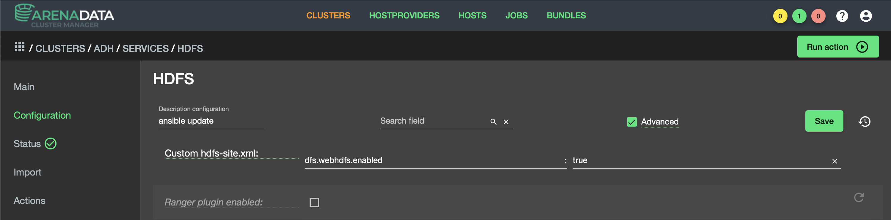
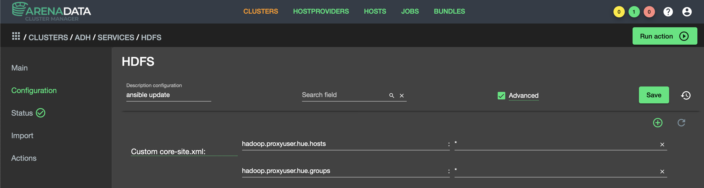

Установка и настройка Hue
==========================

Установите и запустите docker сервис на хосте где будет развернут контейнер с HUE:

::

   yum install -y docker
   systemctl start docker

Загрузите и запустите образ Hue, по умолчание установлен порт 8888

.. important:: Проверьте что указанный порт не используется другими сервисами ADH

::

   docker pull gethue/hue:latest

.. important:: Убедитесь что в для сервиса HDFS установлен компонет HTTPFS, проверить это можно через интерфейс ADCM на странице сервиса HDFS.

Добавьте следующие custom параметры для hdfs-site.xml и core-site.example

   Custom hdfs-site

   Custom core-site

Загрузите следующий файл конфигурации и разместите его на сервере, где будет запущен экземпляр HUE: https://github.com/cloudera/hue/blob/master/desktop/conf.dist/hue.ini

Внесите соответствующие правки в конфигурационный файл hue.ini в разделы [hadoop], [beeswax], [metastore], [spark], [sqoop], [hbase], [search], [zookeeper].
Для всех параметров URL укзажите валидные адреса сервисов вашего кластера Arenadata Hadoop.

После внесения всех изменений выполните следующую команду:

::

   docker run -it -p 8888:8888 -v $PATH/hue.ini:/usr/share/hue/desktop/conf/z-hue.ini gethue/hue

где $PATH - путь к каталогу, где расположен измененный файл hue.identified

После запуска сервис Hue должен быть доступен по порту 8888.
