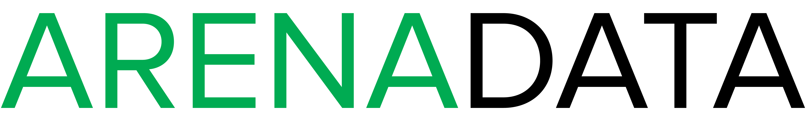

Выжимка основных и часто используемых правил синтаксиса
=========================================================

На вкладке *Preview* (режим редактирования) можно посмотреть отображение набранного текста.

Абзацы отделяются друг от друга пустой строкой. 

Заголовки первого уровня (главы) подчеркиваются символом равно ``=``. Заголовки второго уровня (подглавы) подчеркиваются символом короткого тире или минуса ``-``. Заголовки третьего уровня (подпункта) подчеркиваются символом тильды ``~`` (или ``^``). Для параграфов допускается использовать подчеркивание символами двойных кавычек ``"`` (или тильды, если в предыдущем случаче используется ``^``). 

Заголовок первого уровня в названии документа.

Заголовок второго уровня
-------------------------

Заголовок третьего уровня
^^^^^^^^^^^^^^^^^^^^^^^^^^

Заголовок четвертого уровня
~~~~~~~~~~~~~~~~~~~~~~~~~~~~

Четыре уровня вложенности отображаются в навигации документа при отображении на сайте (в меню слева).

Чтобы выделить текст **жирным** начертанием или *курсивным* используется обособление звездочками.

Начертание текста ``«как есть»`` достигается обособлением двумя обратными кавычками.

Маркированные списки создаются с помощью символа звездочки ``*`` или дефиса ``-``. С пробелом после маркера:

* маркированный список;
* маркированный список:

  * для вложенности добавляются пробелы перед маркером;

    * и пропуск строчки.

Для примеров частей исходного кода или команд используется команда из двух двоеточий ``::``. При этом пустая строка между командой ``::`` и примером кода, а также отступ перед ним, обязательны. Например:

  ::
  
   [realms]
    EXAMPLE.COM = {
      kdc = my.kdc.server
      admin_server = my.kdc.server
   }

Ссылки на другие сайты оформляются по шаблону: `название <адрес ссылки>`_. Например: `Наш сайт <https://arenadata.tech/>`_.

Вставка картинок в текст осуществляется как ссылка на картинку и команда к ней. Например, на рисунке представлен логотип **ARENADATA** (:numref:`Рис.%s.<logo-arenadata-black>`).

.. _logo-arenadata-black:

   Подпись рисунка

Блок текста *важно* создается с помощью кода ``.. important::`` с новой строки:

.. important:: Важная информация

